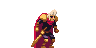
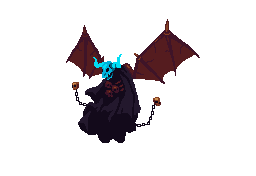

- [Introducción (DRAFT):](#introducci%c3%b3n-draft)
- [Casos de uso](#casos-de-uso)
  - [CU 1. El juego](#cu-1-el-juego)
  - [CU 2. Level 1](#cu-2-level-1)
  - [CU 3. Level 2](#cu-3-level-2)
  - [CU 4. Player](#cu-4-player)
  - [CU 5.Items](#cu-5items)
  - [CU 5.1. Poción vida pequeña](#cu-51-poci%c3%b3n-vida-peque%c3%b1a)
  - [CU 5.2. Llave](#cu-52-llave)
  - [CU 6. Enemigos](#cu-6-enemigos)
  - [CU 6.1. Lobo](#cu-61-lobo)
  - [CU 6.2. Fantasma](#cu-62-fantasma)
  - [CU 6.3. Imp](#cu-63-imp)
  - [CU 6.4. Demon (boss)](#cu-64-demon-boss)
  - [CU 7. GUI](#cu-7-gui)
  

## Introducción (DRAFT):
Sprites: https://ansimuz.itch.io/gothicvania-patreon-collection.
Juego de plataformas 2D ambientado en Castlevania.
El fin es superar los 2 niveles llenos de plataformas y enemigos.
Al final del primer nivel hay que entrar en el portal.
Al final del segundo nivel hay que acabar con el boss.
Tres tipos de enemigos y 1 tipo de boss:
- Lobo (hellhound)	
- Fantasma (ghost)
- Imp (hellbeast)
- El jefe final es el demonio (demon)

## Casos de uso
### CU 1. El juego
- El juego acaba OK si:
  - Player consigue la llave del boss.
  - Al acabar OK se muestra imagen de los creadores
- El juego acaba KO si:
  - La vida del player llega a 0.
  - Aparece pantalla de Game Over con posibilidad de reiniciar
### CU 2. Level 1
- Diseño del level uno, plataformas, enemigos y situación a elección del Diseñador
- Enemigos: Lobo y Fantasma

### CU 3. Level 2
- Diseño del level uno, plataformas, enemigos y situación a elección del Diseñador
- Enemigos: Lobo, Fantasma, Imp y boss demon
	
### CU 4. Player
- Tiene 10 puntos de vida
- Puede saltar y hacer salto doble
- Golpea solo a melee, 1 sólo tipo de golpe. Causo 1 punto de daño a un enemigo. CD de 0.5 seg
- Si cae al vacio pierde toda la vida, vida a 0.
- Si su vida llega a 0, muere
- Puede coger items
- Tiene colision por todas partes con el terreno (no puede hacer como super mario)
- Tocar a un enemigo sin estar atacando implica que el enemigo te haga daño (según diseño)
- Tocar a un enemigo atacando implica que le haces daño por defecto

### CU 5.Items
### CU 5.1. Poción vida pequeña
- Item que cura 3 puntos de vida al player instantaneamente
### CU 5.2. Llave
- Al cogerla el juego acaba bien
	
### CU 6. Enemigos
 - Siempre que se le de un golpe al enemigo este parpadea
### CU 6.1. Lobo
- Se mueve de izquierda a derecha bucle (spikeman)
- Si toca al player le quita 1 de vida
- Tiene 2 puntos de vida
- El sprite asociado es "hellhound"
- Al morir el sprite se difumina y desaparece
- Drop de 1 Poción vida pequeña, random (10%), donde muere el enemigo

### CU 6.2. Fantasma
- Se mueve de izquierda a derecha bucle. Va por el aire (nube)
- Va apareciendo y desapareciendo en el trayecto
- Estando hidden no puede lanzar la calavera
- Si toca al player le quita 1 de vida
- Lanza una calavera en vertical que si toca al player le quita 1 de vida. No se puede eliminar. Timing de 1seg (rayo)
- Tiene 1 punto de vida
- El sprite asociado es "ghost"
- Al morir el sprite se difumina y desaparece
- Drop de 1 Poción vida pequeña, random (20%), donde muere el enemigo

	
### CU 6.3. Imp
- No se mueve
- Tira bolas de fuego en horizontal que hacen 2 puntos de daño. No se puede elminar. Timing de 2seg
- Cuando el player salta por encima(cerca) lanza una columna vertical de fuego. Tamaño determinado por el sprite. La columna de fuego quita 7 puntos de vida
- El enemigo tiene 3 puntos de vida
- Si toca al player le quita 1 de vida
- Al morir el sprite se difumina y desaparece
- El sprite asociado es "hellbeast"
- Drop de 1 Poción vida pequeña, random (40%), donde muere el enemigo
 

### CU 6.4. Demon (boss)
- Se mueve entre 5 puntos fijos de manera aleatoria y en una sala cerrada. No puede moverse 2 veces seguidas al mismo sitio
- Cuando el jugador está cerca lanza "llamarada" (sprite), timing 2 segs y hace 2 puntos de daño.
- Cuando el enemigo está cambiando de punto en el mapa lanza "calaveras" en vertical al igual que Fantasma.
- Si toca al player le hace 1 de daño
- Tiene 10 puntos de vida
- El sprite asociado es "demon"
- Al acabar con él dropeará un item "Llave"
 

	
### CU 7. GUI
- Se muestran los puntos de vida del jugador
- En caso de boss se muestran los puntos del enemigo
- Se muestra el stage en el que se está (1-1, 1-2, 1-3)
- Esta información estará sobre fondo negro en la parte superior d ela pantalla
	
	

